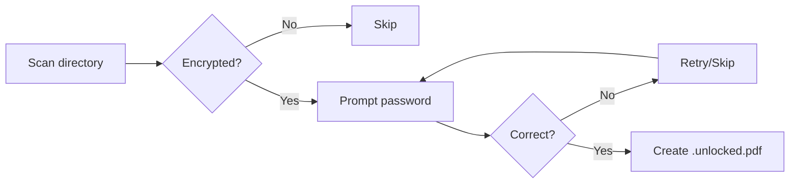

<div align="center">
  

  # pdf-unlocker

  [](LICENSE)
  [](https://python.org)
  [](https://docs.astral.sh/uv/)

  **🔓 Batch unlock password-protected PDFs while keeping your originals safe**

</div>

## ✨ Features

- **Batch processing** — Process entire directories of PDFs at once
- **Smart detection** — Automatically identifies encrypted PDFs, skips unprotected ones
- **Safe output** — Creates `.unlocked.pdf` files, preserving originals
- **Idempotent** — Skips files that already have unlocked versions
- **Interactive retry** — Wrong password? Retry or skip without losing progress
- **Progress tracking** — Visual progress bar with tqdm
- **Secure input** — Passwords are hidden during entry

## 🚀 Quick Start

```bash
# Install with uv
uv tool install git+https://github.com/tsilva/pdf-unlocker.git

# Run
pdf-unlocker /path/to/pdf/folder
```

## 📦 Installation

### Using uv (recommended)

```bash
# Install as a tool (available globally)
uv tool install git+https://github.com/tsilva/pdf-unlocker.git

# Or install from local clone
git clone https://github.com/tsilva/pdf-unlocker.git
cd pdf-unlocker
uv tool install .
```

### Using pip

```bash
git clone https://github.com/tsilva/pdf-unlocker.git
cd pdf-unlocker
pip install .
```

### For development

```bash
git clone https://github.com/tsilva/pdf-unlocker.git
cd pdf-unlocker
uv pip install -e .
```

## 📖 Usage

Point the tool at a directory containing password-protected PDFs:

```bash
pdf-unlocker /path/to/pdf/folder
```

### Example Session

```
$ pdf-unlocker ~/Documents/protected-pdfs
Processing PDFs: 100%|████████████████| 5/5 [00:15<00:00]
2025-01-15 10:30:15 - INFO - Processing encrypted file: document.pdf
Enter password: ********
2025-01-15 10:30:20 - INFO - Successfully unlocked: document.unlocked.pdf
```

### Output

| Input | Output |
|-------|--------|
| `document.pdf` | `document.unlocked.pdf` |
| `report.pdf` | `report.unlocked.pdf` |

- Unlocked files are saved in the same directory as originals
- Original files are never modified
- Already-unlocked files are skipped automatically

## ⚙️ How It Works



1. Scans the target directory for `.pdf` files
2. Attempts to open each PDF without a password
3. If encrypted, prompts for password (input hidden)
4. Creates unlocked version with `.unlocked.pdf` suffix
5. Verifies the unlocked file can be opened successfully

## 📋 Dependencies

| Package | Purpose |
|---------|---------|
| [pikepdf](https://pikepdf.readthedocs.io/) | PDF manipulation |
| [tqdm](https://tqdm.github.io/) | Progress bars |

## 📄 License

This project is licensed under the [MIT License](LICENSE).

---

<div align="center">
  <sub>Built with ❤️ and the help of Claude AI</sub>
</div>
